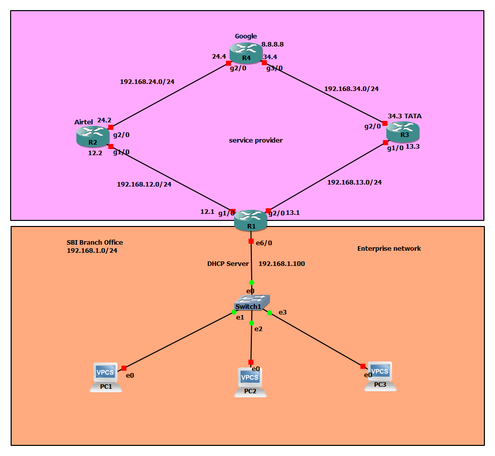

# Bank Enterprise Network Project

This is a small bank enterprise network setup I made using routers, PCs and DHCP.  
The main goal is to give Internet access to bank PCs with **two Internet providers (Airtel and Tata)**.  
If the main link goes down, the standby provider takes over so that the bank network still has connection and users don't face issues.

---

## Network Overview
- **PCs (3)** → getting IPs from DHCP server  
- **DHCP Server** → assigns IP to PCs and forwards traffic  
- **Two ISPs** → Airtel and Tata  
- **Google Router** → acting like the Internet with loopback 8.8.8.8  

Routing is configured with static routes and different administrative distances.  
Failover is tested by shutting down one link and checking connectivity (ping to 8.8.8.8).  

---

## Features
- DHCP server handing out IPs  
- Dual ISP (Airtel as primary, Tata as backup)  
- Static routing with different AD values for failover  
- Google router simulating Internet (loopback 8.8.8.8)  
- Shows how **mismatched preferences between us and Google can cause blackholes**  

---

## How It Works
- On our side (bank side), Airtel is **primary** and Tata is **standby**.  
- On Google side, Tata is **primary** and Airtel is **standby**.  
- When both providers are up → communication works (even if asymmetric).  
- If our Airtel goes down → we switch to Tata, and Google also prefers Tata → traffic flows fine.  
- If our Tata goes down and we only use Airtel → **Google still prefers Tata**, so it sends replies on the Tata path (which is broken on our side).  
  - This creates a **blackhole**: we send packets to Google via Airtel, but replies come back via Tata and never reach us.  

---

## Lab Tests
- `ping 8.8.8.8` from a PC → reply comes fine (normal case).  
- Shut primary link (Airtel) on our side → traffic switches to Tata, pings still work.  
- Shut standby link (Tata) on our side → pings timeout because of blackhole (Google still sends return traffic via Tata).  

---

## Notes
This project shows not only dual ISP failover, but also the **importance of symmetric routing**.  
Using plain static routes with AD can cause blackholes when each side prefers a different ISP.  

Improvements can be done with:
- **IP SLA + tracking** (to check real reachability and remove bad routes)  
- **Dynamic routing protocols** (like OSPF, BGP) to exchange routes and avoid mismatched preferences  

This is just a small lab project to learn about dual ISP setup, failover, and also how asymmetric routing can cause problems.
